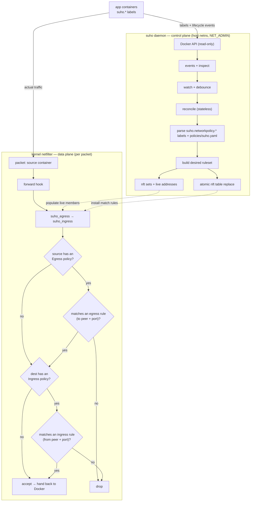

# Architecture

suho is a label-driven L3/L4 network-policy controller for a single Docker host.
It recreates Kubernetes `NetworkPolicy` / `CiliumClusterwideNetworkPolicy`
semantics for plain Docker / Compose: container labels (plus a global
`policies/suho.yaml`) declare who may talk to whom, and suho enforces that with
nftables. It is a **host-level daemon**, not a per-app sidecar.

For the policy model and how to write policies, see
[network-policies.md](network-policies.md); this document is about how suho works
internally.

## Identity model

Container IPs change on every recreate, so policy is never expressed in terms of
IPs. A peer references **stable identity** instead:

- a container's **labels** (`selector`) — its Compose service, a custom label, …
- a Docker **network** (`network`)
- a **CIDR** block (`cidr`)
- a container **name** (`container`)

`network` peers compile to **named nftables sets** (`net_<network>`, e.g.
`{ 172.20.0.5, 172.20.0.9 }`) referenced by a set lookup, so the rendered ruleset
stays readable. `selector`/`container` peers resolve to the matched containers'
current addresses. Every set member and rule is derived **fresh** from the
running containers on each reconcile — this solves the dynamic-IP problem with a
native, atomic nftables primitive. suho is **dual-stack**: IPv4 and IPv6 are
handled side by side (single-family nftables sets are split per family, and rule
expansion never crosses families).

## Control plane and data plane

The verdict follows Kubernetes NetworkPolicy semantics — a flow is allowed only
if **both** ends permit it, and a direction is default-deny **only once a policy
selects that container** for it:

- **Egress @ source:** no Egress policy → unrestricted; otherwise the packet must
  match one `egress` rule (`to` peer + port).
- **Ingress @ dest:** no Ingress policy → unrestricted; otherwise it must match
  one `ingress` rule (`from` peer + port).
- A container with no policy at all is fully unrestricted.

Because the two directions are checked independently, the base `forward` chain
jumps through two regular chains — `suho_egress` then `suho_ingress` — and a
packet must clear both (each returns on a match, or the chain's default-deny
drops it).

Enforcement is **stateful**: the `forward` chain first accepts packets of an
established or related connection (`ct state established,related`), so only a
flow's first packet is policy-checked and reply traffic is never dropped —
matching Kubernetes' conntrack-based semantics.

## Stateless reconcile

suho owns exactly **one** nftables table (`inet suho`) and touches nothing else.
Every reconcile rebuilds the *entire* desired ruleset (chains, rules, set
members) from the current Docker snapshot plus `policies/suho.yaml`, then
**atomically replaces** the table in a single netlink transaction.

This makes orphan cleanup automatic: a stopped or removed container is simply
absent from the next snapshot, so its addresses and rules cannot survive into the
new ruleset — no diffing, no persistent store. Reconciles are event-driven
(Docker events, debounced) with a periodic resync as a safety net for missed
events and restarts.

Runtime configuration is via environment variables: `SUHO_LABEL_PREFIX`,
`SUHO_POLICIES_PATH`, `SUHO_RESYNC_INTERVAL`, `SUHO_DEBOUNCE_MS`, and
`SUHO_METRICS_ADDR` (opt-in metrics/health server), plus the `--dry-run` flag.

## Enforcement and Docker coexistence

suho runs in the host network namespace with `CAP_NET_ADMIN` and reads the Docker
API read-only (directly, or via a socket proxy). Its rules sit in the `forward`
hook at a priority that runs **before** Docker's own accept, so suho can drop
traffic Docker would otherwise allow.

The subtle requirement is **bridged** traffic: two containers on the same Docker
bridge are L2-switched and only traverse the `forward` (netfilter) hook when
`br_netfilter` is loaded with `net.bridge.bridge-nf-call-iptables=1`. Without it,
container-to-container and ingress policies are not enforced (routed egress to
the internet still is), so suho warns at startup when the setting is off. On a
firewalld host, enabling it also exposes bridged traffic to firewalld's forward
policy — reconcile the two.

## Backends

Enforcement is pluggable behind an `Enforcer` trait:

- **`NftEnforcer`** — programs nftables directly over netlink (via `rustables`),
  so the image needs no `nft` binary.
- **logging backend** — selected by `--dry-run`; renders the resolved ruleset to
  the log and programs nothing. Useful for validating policy without root.

## Observability

Setting `SUHO_METRICS_ADDR` (e.g. `127.0.0.1:9090`) starts an axum HTTP server:

- `GET /metrics` — Prometheus text: reconcile counters labeled by `trigger`
  (startup/event/resync) and `result`, a reconcile-duration histogram, the
  last-success timestamp, rule (by `chain`) and set gauges, watcher restarts,
  and build info.
- `GET /healthz` — liveness (200 while the process runs).
- `GET /readyz` — readiness (200 after the first successful reconcile).

If the **initial** reconcile fails, suho exits non-zero (fail-closed) rather than
run with no rules in place. Later reconcile errors are logged and the previous
(atomically applied) ruleset stays in force.

## Implementation

Written in **Rust** for a stronger safety story on a privileged `NET_ADMIN`
network daemon (precedent: Mullvad's VPN, a privileged nftables firewall in Rust).

- **Async runtime:** `tokio`.
- **Docker:** `bollard` (events + inspect over the socket).
- **nftables:** `rustables` (netlink; named sets; no `nft` binary in the image).
- **Config / policy:** `serde` + `serde_yaml_ng` for inline label YAML and
  `policies/suho.yaml`; `schemars` generates the JSON Schema (`suho schema`).
- **Logging:** `tracing`.

The build compiles `rustables`, which runs `bindgen`, so it needs `clang` plus
the kernel UAPI headers (`linux-api-headers` on Arch, `linux-libc-dev` on
Debian/Ubuntu). The result is a small static binary shipped in a distroless
image.

## Non-goals and open questions

**Non-goals:** L7 (HTTP paths/methods) — that belongs at a reverse proxy such as
Traefik; multi-host / overlay policy — suho governs a single host.

**Open questions:**

- Default posture for intra-network traffic: default-allow (Docker-like) vs
  default-deny — a per-network or global toggle?
- Set scope for identity across multiple networks: per-network vs global?
- Startup behaviour before the first successful reconcile: fail-open vs
  fail-closed?
